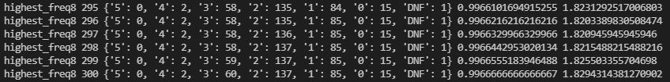

# OctordleBot
This AI currently has an accuracy of approximately 99.67% and an average steps-per-game of 11.17 (1.83 steps remaining) using the answer list (2315 words)-
 

 
In the image above, the number of guesses remaining is shown in a dictionary (5: 0, 4: 2...).
The numbers following the dictionary is the accuracy (percent of games completed) and the average steps remaining per completed game, respectively.
 
 
# How it Works
The AI makes the same first guess every game- "salet". This word is statistically the best word to pick based on the Octordle word list.
  
Subsequent guesses are made by filtering the lists of possible words by removing the words that include letters that have already been guessed and selecting the remaining word with the greatest word score. The word score is given by the sum of each letter's frequency in the list of possible answers, not including repeated letters within the word. Answers are inputted as soon as they are found.
  
The AI chooses the column with the most possible answers to focus on for making a guess. If there is a case (that is not the last available guess) where a list is between 3 and 6 words and at least half of the words (rounded down) have at least 3 of the same letters in common, the AI will look at the full list and guess a word with the highest word score that excludes the letters in common (this is also referred to as a "blimp search" in the code). After a guess is made, the list of possible words is filtered based on the letters that are in the word and the letters that are in the correct position. The words that contain letters that are not in the word are removed.
  
A webdriver was also created using Selenium, which allows the user to open up Octordle directly through the code and watch the AI play through the game.

___

Credit to https://octordle.com/, ©2022	Kenneth Crawford
